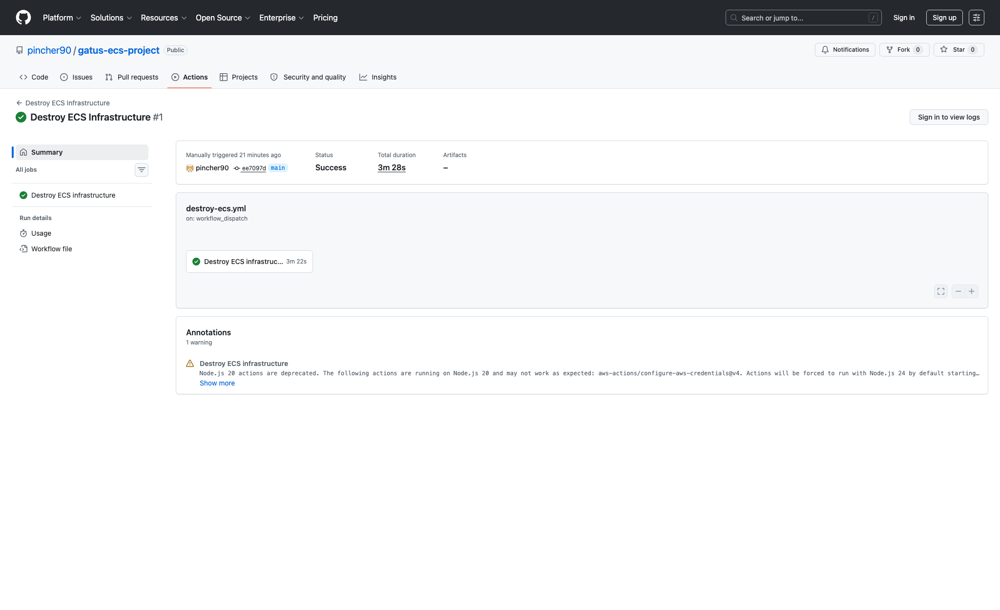
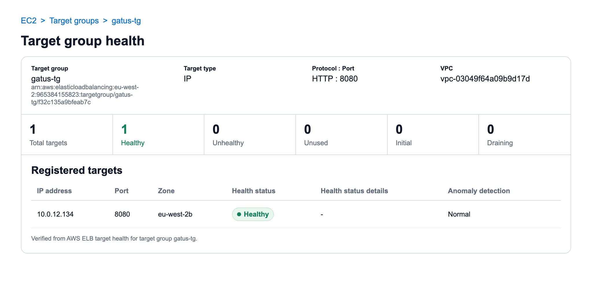
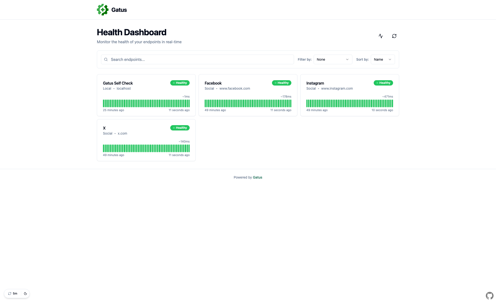

# Gatus on ECS with Terraform

This project runs [Gatus](https://github.com/TwiN/gatus) on AWS ECS Fargate with Terraform and GitHub Actions.

It follows the full deployment path from code to a working HTTPS service: Terraform provisions the AWS resources, GitHub Actions builds and pushes the container image, and Cloudflare delegates `gatus.appjojocloud.com` to Route 53 for application DNS.

The first version is focused on the core pieces needed for a real ECS deployment: private ECS tasks, a public ALB, TLS, ECR, CloudWatch logs, remote Terraform state, and GitHub Actions OIDC instead of long lived AWS keys.

## Table of Contents

1. [What It Builds](#what-it-builds)
2. [Live URL](#live-url)
3. [What I Built](#what-i-built)
4. [Repository Structure](#repository-structure)
5. [Tech Stack](#tech-stack)
6. [Local Setup for Developers](#local-setup-for-developers)
7. [Deployment Flow](#deployment-flow)
8. [Current Gatus Configuration](#current-gatus-configuration)
9. [Validation and Security Checks](#validation-and-security-checks)
10. [Pipeline Evidence](#pipeline-evidence)
11. [Troubleshooting and Operations](#troubleshooting-and-operations)
12. [Future Plans](#future-plans)
13. [Why This Project](#why-this-project)

## What It Builds


Architecture diagram exported from Lucidchart.

The project creates:

- A custom AWS VPC in `eu-west-2`.
- Public and private subnets across two Availability Zones.
- Internet Gateway for public ingress.
- NAT Gateway for private subnet outbound access.
- ECS Fargate cluster and service running Gatus.
- Public Application Load Balancer with HTTP to HTTPS redirect.
- HTTPS listener backed by ACM.
- Terraform-managed ACM validation records in Route 53.
- Route 53 alias record pointing the public hostname at the ALB.
- ECR repository for immutable Gatus images.
- CloudWatch logging for ECS application logs.
- GitHub Actions OIDC roles for ECR pushes and Terraform deploys.

The latest Route 53 based deployment was verified successfully with image tag `4d170ab`. The app layer was then removed with Terraform destroy so the teardown path could be tested as well.

## Live URL

When the app infrastructure is deployed, the Gatus dashboard is available at:

```text
https://gatus.appjojocloud.com
```

Cloudflare manages DNS for `appjojocloud.com`. The `gatus` subdomain is delegated to Route 53, where Terraform manages the application DNS records and points the hostname at the ALB.

The ALB redirects HTTP traffic to HTTPS and uses an ACM certificate issued for `gatus.appjojocloud.com`.

After the destroy workflow has run, the Cloudflare delegation and Route 53 hosted zone remain in place. Terraform recreates the ACM certificate records and ALB alias record when the app layer is deployed again.

## What I Built

### AWS Infrastructure with Terraform

- Modular Terraform layout for VPC, security groups, ALB, ECS, ECR, ACM certificate validation, and Route 53 DNS.
- Remote Terraform state stored in S3.
- Environment specific values in `infra/envs/dev.tfvars`, including ECS CPU, memory, and desired task count.
- Public and private route tables with subnet associations.
- Common AWS tags applied through the Terraform AWS provider.
- Minimal baseline security focused on private ECS tasks, security groups, TLS, and short lived CI/CD credentials.

### Container Platform on ECS

- ECS cluster with Container Insights enabled.
- Fargate task definition for the Gatus container.
- ECS service deployed into private subnets.
- No public IP assigned to application tasks.
- Security group access limited to ALB traffic on port `8080`.
- CloudWatch log group for application logs with 365 day retention.

### Load Balancing and TLS

- Public Application Load Balancer across public subnets.
- HTTP listener on port `80` redirecting to HTTPS.
- HTTPS listener on port `443` forwarding to the ECS target group.
- Terraform-managed ACM certificate validation through Route 53.
- Optional public access protections and network logging can be added later as a hardening phase.

### Image Build and Delivery

- Multi stage Dockerfile that builds Gatus from source.
- Minimal `scratch` runtime image.
- Non root container user.
- Gatus configuration stored in `app/config/config.yaml` with local and public website checks.
- ECR repository with immutable tags.
- Image scanning enabled on push.
- Trivy scan in the Docker build workflow.

### GitHub Actions and OIDC

- GitHub Actions authenticates to AWS with OpenID Connect.
- No long lived AWS access keys are required by workflows.
- Dedicated role for Docker image pushes to ECR.
- Dedicated role for Terraform based ECS deploys.
- Terraform CI workflow runs format, init, validate, TFLint, and Checkov.
- Manual ECS deployment workflow accepts an image tag and applies Terraform.
- Manual destroy workflow tears down the app infrastructure only after a typed confirmation.

## Repository Structure

```text
.
|-- app/
|   |-- Dockerfile
|   `-- config/
|       `-- config.yaml
|-- docs/
|   |-- architecture.svg
|   `-- screenshots/
|       |-- deploy-ecs-success.png
|       |-- destroy-workflow-success.png
|       |-- docker-build-push-success.png
|       |-- gatus-live-site.png
|       |-- target-group-healthy.png
|       `-- terraform-ci-success.png
|-- infra/
|   |-- envs/
|   |   `-- dev.tfvars
|   |-- modules/
|   |   |-- alb/
|   |   |-- certificate/
|   |   |-- dns/
|   |   |-- ecr/
|   |   |-- ecs/
|   |   |-- security/
|   |   `-- vpc/
|   |-- bootstrap/
|   |-- backend.tf
|   |-- certificate.tf
|   |-- dns.tf
|   |-- locals.tf
|   |-- main.tf
|   |-- outputs.tf
|   |-- provider.tf
|   |-- variables.tf
|   `-- versions.tf
`-- .github/
    `-- workflows/
        |-- deploy-ecs.yml
        |-- destroy-ecs.yml
        |-- docker-build-push.yml
        `-- terraform-ci.yml
```

## Tech Stack

- AWS
- ECS Fargate
- ECR
- Application Load Balancer
- ACM
- Route 53
- Cloudflare
- CloudWatch Logs
- S3 remote state
- Terraform
- Docker
- Gatus
- GitHub Actions
- GitHub Actions OIDC
- TFLint
- Checkov
- Trivy

## Local Setup for Developers

These steps are for someone cloning the repository who wants to understand or test the project locally before touching AWS.

### Prerequisites

- Git
- Docker
- Terraform
- AWS CLI, only required for AWS deployment
- An AWS account, only required for AWS deployment

### Clone the Repository

```bash
git clone https://github.com/pincher90/gatus-ecs-project.git
cd gatus-ecs-project
```

### Run Gatus Locally with Docker

The quickest way to test the application is to build the container from the repository root:

```bash
docker build -t gatus-local -f app/Dockerfile .
docker run --rm -p 8080:8080 gatus-local
```

Then visit:

```text
http://localhost:8080
```

This runs the same Gatus configuration used by the ECS task:

```text
app/config/config.yaml
```

The local Docker setup does not need AWS credentials, ECR, Terraform state, GitHub Actions, or OIDC. It only proves that the Gatus container builds and starts correctly.

### Validate Terraform Locally

You can validate the Terraform without connecting to the remote S3 backend:

```bash
terraform -chdir=infra init -backend=false
terraform -chdir=infra validate

terraform -chdir=infra/bootstrap init -backend=false
terraform -chdir=infra/bootstrap validate
```

This is useful for checking syntax and module wiring before running a real deployment.

### Reproduce the Full AWS Setup

To deploy your own copy of the full platform, update the repository specific values first:

- `infra/backend.tf` and `infra/bootstrap/backend.tf`: use your own S3 state bucket and state keys.
- `infra/bootstrap/variables.tf`: update `github_owner`, `github_repo`, and `github_subjects`.
- `.github/workflows/docker-build-push.yml`: update the AWS account ID, ECR repository URI, and ECR role ARN.
- `.github/workflows/deploy-ecs.yml`: update the AWS account ID and Terraform deploy role ARN.
- `infra/envs/dev.tfvars`: adjust the AWS region, project name, environment name, CIDR ranges, Availability Zones, ECS sizing, and public hostname values if needed.

The bootstrap order is:

1. Create or choose an S3 bucket for Terraform state.
2. Configure AWS credentials locally with permission to create IAM roles and the GitHub OIDC provider.
3. Apply the bootstrap layer:

```bash
cd infra/bootstrap
terraform init
terraform apply
```

4. Copy the generated role ARNs into the GitHub Actions workflow files.
5. Create the ECR repository once, so the Docker workflow has somewhere to push the first image:

```bash
terraform -chdir=infra init
terraform -chdir=infra apply \
  -target=module.ecr \
  -var-file="envs/dev.tfvars" \
  -var="image_tag=bootstrap"
```

6. Create a Route 53 hosted zone for `gatus.appjojocloud.com` and add its nameservers as `NS` records in Cloudflare for the `gatus` subdomain.
7. Push an app change to `main` to trigger the Docker build and ECR push workflow.
8. Run the `Deploy ECS` GitHub Actions workflow manually with the image tag produced by the Docker workflow. Terraform creates the ACM certificate, DNS validation record, and Route 53 alias record during deployment.

The AWS deployment creates paid resources such as a NAT Gateway, ALB, ECS Fargate tasks, and CloudWatch logs. Destroy the app layer when it is no longer needed. Locally, run:

```bash
cd infra
terraform destroy \
  -var-file="envs/dev.tfvars" \
  -var="image_tag=<image-tag>"
```

Or use the `Destroy ECS Infrastructure` workflow in GitHub Actions. It is manual only and requires typing `destroy` into the confirmation box before Terraform runs a destroy plan and applies it.

The bootstrap layer is intentionally separate from the main app infrastructure. Keeping it separate means CI/CD access can survive app teardown, which avoids breaking GitHub Actions every time the ECS environment is destroyed.

## Deployment Flow

### 1. Bootstrap GitHub Actions OIDC

The bootstrap layer creates the GitHub OIDC provider and IAM roles used by GitHub Actions:

- `gatus-github-ecr-role` for Docker image pushes to ECR.
- `gatus-github-terraform-role` for Terraform deploys.

Apply this layer once with existing AWS credentials:

```bash
cd infra/bootstrap
terraform init
terraform apply
```

The trust policy is scoped to:

```text
repo:pincher90/gatus-ecs-project:ref:refs/heads/main
```

### 2. Prepare Route 53 Delegation

Cloudflare manages the parent domain, `appjojocloud.com`. The `gatus` subdomain is delegated to Route 53 with `NS` records in Cloudflare.

The Route 53 hosted zone for `gatus.appjojocloud.com` is kept outside the main app destroy flow so the delegated nameservers stay stable. Terraform looks up that hosted zone through the certificate and DNS modules, creates the ACM certificate, writes the DNS validation record, waits for the certificate to be issued, and creates the alias record to the ALB.

The one manual DNS prerequisite is adding the Route 53 nameservers to Cloudflare for the `gatus` subdomain. After that delegation exists, Terraform manages the application DNS records and certificate validation records.

### 3. Bootstrap ECR

The Docker workflow cannot push the first image until ECR exists. Create only the ECR module once:

```bash
terraform -chdir=infra init
terraform -chdir=infra apply \
  -target=module.ecr \
  -var-file="envs/dev.tfvars" \
  -var="image_tag=bootstrap"
```

The placeholder image tag is only needed because Terraform variables are required. The targeted ECR apply does not use the image tag.

The ECR repository has immutable tags, scan on push, KMS encryption, and `force_delete` enabled so the destroy workflow can remove the app layer cleanly even when images exist.

### 4. Build and Push the Container Image

The Docker workflow runs automatically when files under `app/**` change on `main`.

It will:

- Build the Gatus image for `linux/amd64`.
- Tag the image with the short Git commit SHA.
- Scan the image with Trivy.
- Push the image to ECR.

Evidence from the build pipeline shows successful image tags including `cc4e35d`, `291c1b4`, and `4d170ab`. The app infrastructure can be destroyed and recreated, so the ECR repository may not exist until the bootstrap ECR step or full app deployment is run again.

### 5. Deploy to ECS

The ECS deploy workflow is manually triggered with an image tag.

For a local deployment:

```bash
cd infra
terraform init
terraform apply \
  -var-file="envs/dev.tfvars" \
  -var="image_tag=<image-tag>"
```

After deployment, get the ALB DNS name:

```bash
terraform output alb_dns_name
```

Terraform creates the Route 53 alias record that points the delegated hostname at the ALB.

The latest verified ECS deployment used:

```text
965384155823.dkr.ecr.eu-west-2.amazonaws.com/gatus-repo:4d170ab
```

The service was active with one desired task and one running task before the destroy workflow was run.

### 6. Tear Down the App Infrastructure

The `Destroy ECS Infrastructure` workflow is available for manual cleanup of the app layer. It uses the same GitHub OIDC Terraform role as the deploy workflow, runs `terraform plan -destroy`, then applies the saved plan.

To run it from GitHub Actions:

1. Open the `Destroy ECS Infrastructure` workflow.
2. Type `destroy` into the confirmation input.
3. Leave the default placeholder image tag unless you want to pass a specific value.
4. Start the workflow.

This destroys the Terraform resources in `infra`. It does not destroy the separate bootstrap layer in `infra/bootstrap`.

## Current Gatus Configuration

The current Gatus config includes a local self check and public social website checks:

```yaml
endpoints:
  - name: Gatus Self Check
    group: Local
    url: "http://localhost:8080"
    interval: 30s
    conditions:
      - "[STATUS] == 200"

  - name: Facebook
    group: Social
    url: "https://www.facebook.com"
    interval: 1m
    conditions:
      - "[STATUS] == 200"

  - name: X
    group: Social
    url: "https://x.com"
    interval: 1m
    conditions:
      - "[STATUS] == 200"

  - name: Instagram
    group: Social
    url: "https://www.instagram.com"
    interval: 1m
    conditions:
      - "[STATUS] == 200"
```

This can be expanded with more internal and external service checks as the platform grows.

## Validation and Security Checks

Terraform CI currently runs:

- `terraform fmt -check -recursive`
- `terraform init -backend=false` for the app infrastructure
- `terraform validate` for the app infrastructure
- `terraform init -backend=false` for the bootstrap layer
- `terraform validate` for the bootstrap layer
- `tflint`
- `checkov`

The image pipeline currently runs:

- Docker build for `linux/amd64`
- Trivy vulnerability scan for `CRITICAL` and `HIGH` findings
- ECR push only after the scan passes

The Terraform CI and Docker image workflows can also be started manually from GitHub Actions using `workflow_dispatch`.

## Pipeline Evidence

### Terraform CI

The Terraform CI workflow has passed with formatting, validation, TFLint, and Checkov checks completed successfully.


### Docker Build and Push

The Docker image workflow has passed with AWS OIDC authentication, ECR login, image build, Trivy scan, and ECR push completed successfully.


### ECS Deploy

The ECS deploy workflow has passed with GitHub Actions OIDC authentication, Terraform init, and Terraform apply completed successfully.


### Destroy Workflow

The destroy workflow has passed after a manual confirmation. It ran Terraform destroy for the app infrastructure while leaving the separate bootstrap layer in place.



### AWS Runtime Checks

Before teardown, the deployed AWS resources were also checked from the AWS side:

- ECR contained the image tag used for the verified deployment.
- ECS service `gatus-service` was active with `1` desired task and `1` running task.
- ALB listener `HTTP:80` redirects to `HTTPS:443`.
- ALB listener `HTTPS:443` forwards traffic to target group `gatus-tg`.
- Target group `gatus-tg` had one healthy ECS task target on port `8080`.
- The ALB security group allows public `80` and `443` traffic, then sends only port `8080` traffic toward ECS.
- The ECS task security group allows inbound `8080` only from the ALB security group, with outbound HTTPS and DNS access via the NAT Gateway.
- The HTTPS endpoint `https://gatus.appjojocloud.com` returned `200`.



### Live Gatus Dashboard

Before teardown, the Gatus dashboard was reachable over HTTPS through the delegated DNS path and the public ALB. The dashboard showed the local self check plus Facebook, X, and Instagram endpoint checks as healthy.



## Troubleshooting and Operations

Issues worked through during the build include:

- Replacing static AWS credentials with GitHub Actions OIDC.
- Separating bootstrap IAM from application infrastructure.
- Scoping GitHub OIDC trust to the `main` branch.
- Bootstrapping ECR before the first Docker image push.
- Delegating the application subdomain from Cloudflare to Route 53 for ACM validation and ALB DNS.
- Wiring an HTTPS only ALB flow to private ECS Fargate tasks.
- Keeping the first working version intentionally minimal so the deployment path is easy to understand.
- Handling Checkov findings with explicit rationale where appropriate.

## Future Plans

- Adding more meaningful internal and external Gatus checks.
- Adding ECS autoscaling policies.
- Considering VPC endpoints to reduce NAT dependency.
- Adding optional public access protection and deeper network logging as a later hardening phase.
- Splitting environments beyond the current dev setup.
- Documenting the operational runbook for releases and rollbacks.

## Why This Project

This project shows an end to end ECS deployment built with Terraform and GitHub Actions. It covers the infrastructure and release workflow a small production service needs: private networking, ECS Fargate, IAM, ECR, ALB routing, TLS, GitHub Actions OIDC, image scanning, Terraform checks, and the day to day troubleshooting that comes with wiring everything together.
