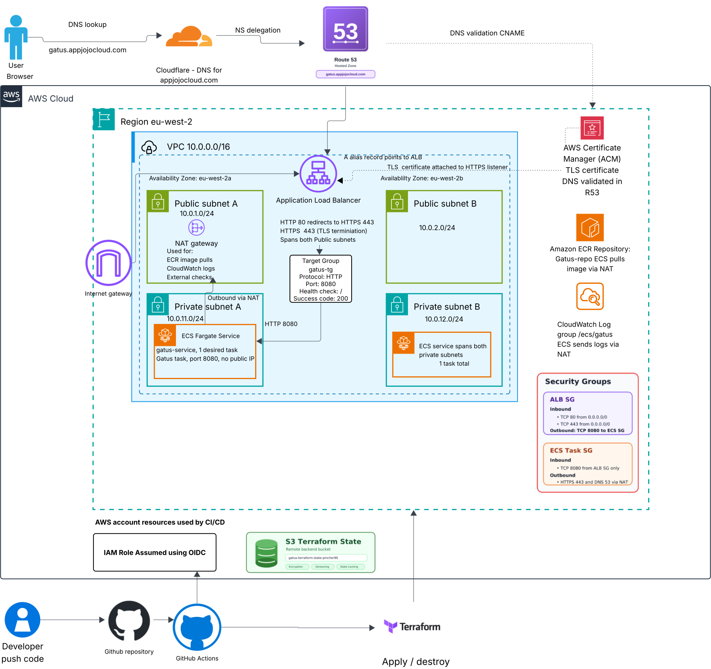
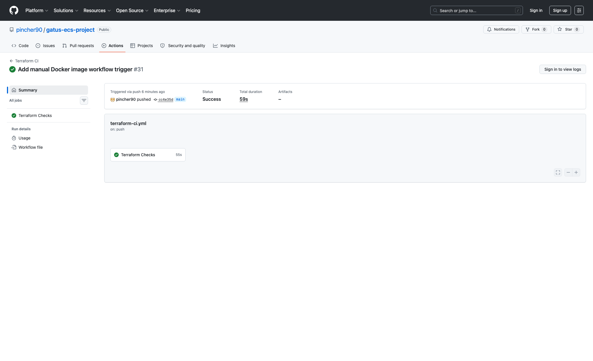
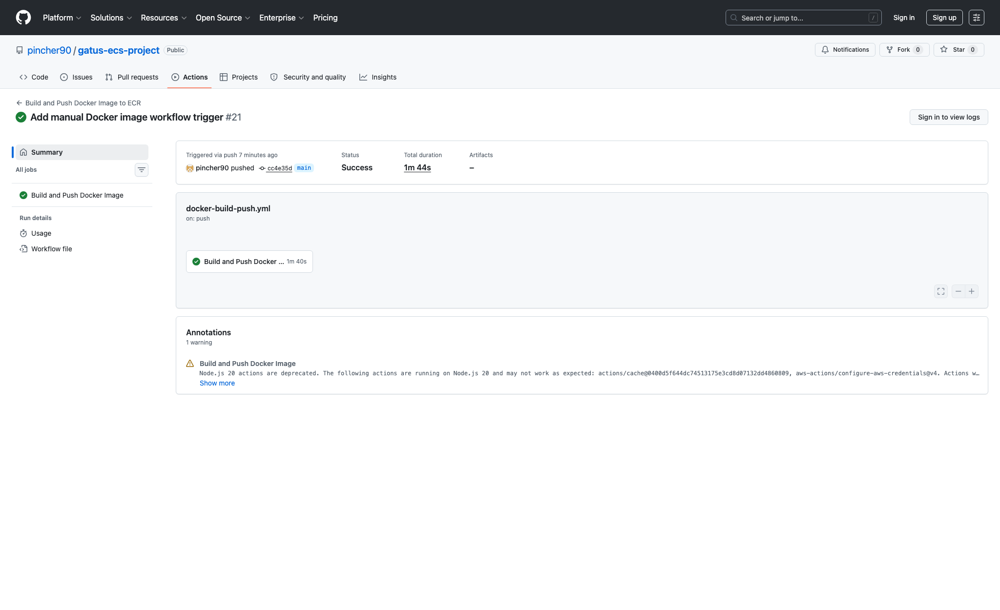
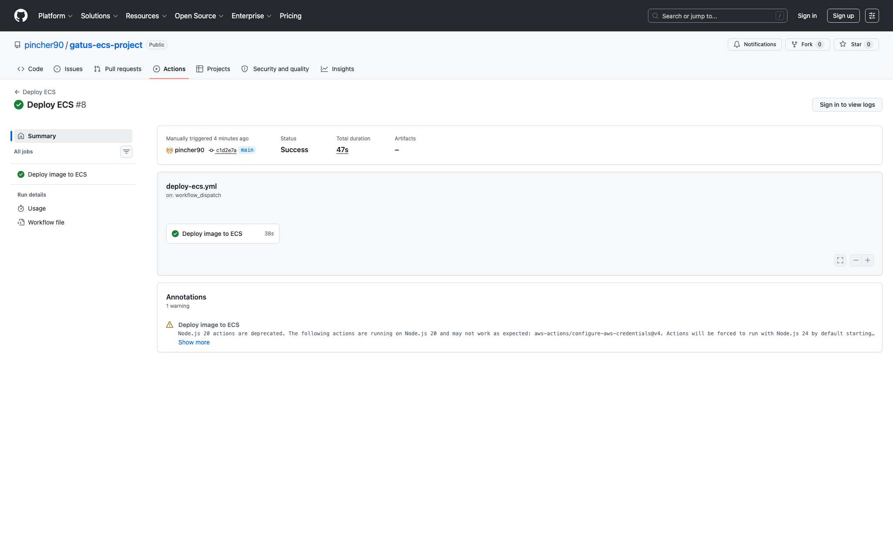

# Gatus ECS Platform Project

An AWS ECS monitoring platform built with Terraform, GitHub Actions, and minimal secure container delivery.

This project deploys [Gatus](https://github.com/TwiN/gatus), a lightweight uptime and status monitoring tool, onto AWS ECS Fargate.

The goal is to build a small, understandable container platform around a real workload, covering private networking, image delivery, load balancing, TLS, basic logging, and CI/CD without relying on long-lived AWS credentials.

---

## What This Project Builds



Editable diagrams.net source: [docs/architecture.drawio](docs/architecture.drawio).

The platform currently provisions:

- A custom AWS VPC in `eu-west-2`.
- Public and private subnets across two Availability Zones.
- Internet Gateway for public ingress.
- NAT Gateway for private subnet outbound access.
- ECS Fargate cluster and service running Gatus.
- Public Application Load Balancer with HTTP to HTTPS redirect.
- ACM-backed HTTPS listener.
- ECR repository for immutable Gatus images.
- CloudWatch logging for ECS application logs.
- GitHub Actions OIDC roles for ECR pushes and Terraform deploys.

The latest verified deployment is running image tag `291c1b4` from ECR on ECS task definition `gatus-task:20`. The ECS service is active with `1/1` Fargate task running, and the ALB target group has a healthy target on port `8080`.

---

## What I Have Implemented So Far

### AWS Infrastructure with Terraform

- Modular Terraform layout for VPC, security groups, ALB, ECS, and ECR.
- Remote Terraform state stored in S3.
- Environment-specific values in `infra/envs/dev.tfvars`.
- Public and private route tables with subnet associations.
- Minimal baseline security focused on private ECS tasks, security groups, TLS, and short-lived CI/CD credentials.

### Container Platform on ECS

- ECS cluster with Container Insights enabled.
- Fargate task definition for the Gatus container.
- ECS service deployed into private subnets.
- No public IP assigned to application tasks.
- Security group access limited to ALB traffic on port `8080`.
- CloudWatch log group for application logs with 365 day retention.

### Load Balancing, TLS, and Edge Security

- Public Application Load Balancer across public subnets.
- HTTP listener on port `80` redirecting to HTTPS.
- HTTPS listener on port `443` forwarding to the ECS target group.
- External ACM certificate support for domains managed in Cloudflare.
- Optional edge and network logging controls can be added later as a hardening phase.

### Image Build and Delivery

- Multi-stage Dockerfile that builds Gatus from source.
- Minimal `scratch` runtime image.
- Non-root container user.
- Gatus configuration stored in `app/config/config.yaml` with local and public website checks.
- ECR repository with immutable tags.
- Image scanning enabled on push.
- Trivy scan in the Docker build workflow.

### GitHub Actions and OIDC

- GitHub Actions authenticates to AWS with OpenID Connect.
- No long-lived AWS access keys are required by workflows.
- Dedicated role for Docker image pushes to ECR.
- Dedicated role for Terraform-based ECS deploys.
- Terraform CI workflow runs format, init, validate, TFLint, and Checkov.
- Manual ECS deployment workflow accepts an image tag and applies Terraform.

---

## Repository Structure

```text
.
|-- app/
|   |-- Dockerfile
|   `-- config/
|       `-- config.yaml
|-- docs/
|   |-- architecture.drawio
|   |-- architecture.svg
|   `-- screenshots/
|       |-- deploy-ecs-success.png
|       |-- docker-build-push-success.png
|       `-- terraform-ci-success.png
|-- infra/
|   |-- envs/
|   |   `-- dev.tfvars
|   |-- modules/
|   |   |-- alb/
|   |   |-- ecr/
|   |   |-- ecs/
|   |   |-- security/
|   |   `-- vpc/
|   |-- oidc/
|   |-- backend.tf
|   |-- main.tf
|   |-- outputs.tf
|   |-- provider.tf
|   |-- variables.tf
|   `-- versions.tf
`-- .github/
    `-- workflows/
        |-- deploy-ecs.yml
        |-- docker-build-push.yml
        `-- terraform-ci.yml
```

---

## Tech Stack

- AWS
- ECS Fargate
- ECR
- Application Load Balancer
- ACM
- CloudWatch Logs
- S3 remote state
- Terraform
- Docker
- Gatus
- GitHub Actions
- GitHub Actions OIDC
- TFLint
- Checkov
- Trivy

---

## Local Setup for Developers

These steps are for someone cloning the repository who wants to understand or test the project locally before touching AWS.

### Prerequisites

- Git
- Docker
- Terraform
- AWS CLI, only required for AWS deployment
- An AWS account, only required for AWS deployment

### Clone the Repository

```bash
git clone https://github.com/pincher90/gatus-ecs-project.git
cd gatus-ecs-project
```

### Run Gatus Locally with Docker

The quickest way to test the application is to build the container from the repository root:

```bash
docker build -t gatus-local -f app/Dockerfile .
docker run --rm -p 8080:8080 gatus-local
```

Then visit:

```text
http://localhost:8080
```

This runs the same Gatus configuration used by the ECS task:

```text
app/config/config.yaml
```

The local Docker setup does not need AWS credentials, ECR, Terraform state, GitHub Actions, or OIDC. It only proves that the Gatus container builds and starts correctly.

### Validate Terraform Locally

You can validate the Terraform without connecting to the remote S3 backend:

```bash
terraform -chdir=infra init -backend=false
terraform -chdir=infra validate

terraform -chdir=infra/oidc init -backend=false
terraform -chdir=infra/oidc validate
```

This is useful for checking syntax and module wiring before running a real deployment.

### Reproduce the Full AWS Setup

To deploy your own copy of the full platform, update the repository-specific values first:

- `infra/backend.tf` and `infra/oidc/backend.tf`: use your own S3 state bucket and state keys.
- `infra/oidc/variables.tf`: update `github_owner`, `github_repo`, and `github_subjects`.
- `.github/workflows/docker-build-push.yml`: update the AWS account ID, ECR repository URI, and ECR role ARN.
- `.github/workflows/deploy-ecs.yml`: update the AWS account ID and Terraform deploy role ARN.
- `infra/envs/dev.tfvars`: adjust the AWS region, project name, CIDR ranges, and Availability Zones if needed.

The bootstrap order is:

1. Create or choose an S3 bucket for Terraform state.
2. Configure AWS credentials locally with permission to create IAM roles and the GitHub OIDC provider.
3. Apply the OIDC layer:

```bash
cd infra/oidc
terraform init
terraform apply
```

4. Copy the generated role ARNs into the GitHub Actions workflow files.
5. Create the ECR repository once, so the Docker workflow has somewhere to push the first image:

```bash
terraform -chdir=infra init
terraform -chdir=infra apply \
  -target=module.ecr \
  -var-file="envs/dev.tfvars" \
  -var="image_tag=bootstrap" \
  -var="alb_certificate_arn=bootstrap"
```

6. Request an ACM certificate in `eu-west-2`, validate it through DNS, and add the certificate ARN as a GitHub Actions secret named:

```text
ALB_CERTIFICATE_ARN
```

7. Push an app change to `main` to trigger the Docker build and ECR push workflow.
8. Run the `Deploy ECS` GitHub Actions workflow manually with the image tag produced by the Docker workflow.

The AWS deployment creates paid resources such as a NAT Gateway, ALB, ECS Fargate tasks, and CloudWatch logs. Destroy the app layer when it is no longer needed:

```bash
cd infra
terraform destroy \
  -var-file="envs/dev.tfvars" \
  -var="image_tag=<image-tag>" \
  -var="alb_certificate_arn=<certificate-arn>"
```

The OIDC layer is intentionally separate from the main app infrastructure. Keeping it separate means CI/CD access can survive app teardown, which avoids breaking GitHub Actions every time the ECS environment is destroyed.

---

## Deployment Flow

### 1. Bootstrap GitHub Actions OIDC

The OIDC bootstrap layer creates the IAM roles used by GitHub Actions:

- `gatus-github-ecr-role` for Docker image pushes to ECR.
- `gatus-github-terraform-role` for Terraform deploys.

Apply this layer once with existing AWS credentials:

```bash
cd infra/oidc
terraform init
terraform apply
```

The trust policy is scoped to:

```text
repo:pincher90/gatus-ecs-project:ref:refs/heads/main
```

### 2. Prepare the ACM Certificate

DNS is managed in Cloudflare, so the ACM certificate is treated as an external prerequisite.

Request the certificate in AWS ACM in `eu-west-2`, validate it using the Cloudflare DNS CNAME that ACM provides, and store the issued certificate ARN in the GitHub Actions secret:

```text
ALB_CERTIFICATE_ARN
```

For local Terraform runs, pass the same ARN as a variable.

### 3. Bootstrap ECR

The Docker workflow cannot push the first image until ECR exists. Create only the ECR module once:

```bash
terraform -chdir=infra init
terraform -chdir=infra apply \
  -target=module.ecr \
  -var-file="envs/dev.tfvars" \
  -var="image_tag=bootstrap" \
  -var="alb_certificate_arn=bootstrap"
```

The placeholder values are only needed because Terraform variables are required. The targeted ECR apply does not use the image tag or certificate ARN.

### 4. Build and Push the Container Image

The Docker workflow runs automatically when files under `app/**` change on `main`.

It will:

- Build the Gatus image for `linux/amd64`.
- Tag the image with the short Git commit SHA.
- Scan the image with Trivy.
- Push the image to ECR.

The current ECR repository contains successful image tags `cc4e35d` and `291c1b4`. The latest image, `291c1b4`, was built after adding the public social endpoint checks.

### 5. Deploy to ECS

The ECS deploy workflow is manually triggered with an image tag.

For a local deployment:

```bash
cd infra
terraform init
terraform apply \
  -var-file="envs/dev.tfvars" \
  -var="image_tag=<image-tag>" \
  -var="alb_certificate_arn=<certificate-arn>"
```

After deployment, get the ALB DNS name:

```bash
terraform output alb_dns_name
```

Point the Cloudflare DNS record for the chosen hostname at the ALB DNS name.

The latest verified ECS deployment uses:

```text
965384155823.dkr.ecr.eu-west-2.amazonaws.com/gatus-repo:291c1b4
```

The service is active with one desired task and one running task.

---

## Current Gatus Configuration

The current Gatus config includes a local self-check and public social website checks:

```yaml
endpoints:
  - name: Gatus Self Check
    group: Local
    url: "http://localhost:8080"
    interval: 30s
    conditions:
      - "[STATUS] == 200"

  - name: Facebook
    group: Social
    url: "https://www.facebook.com"
    interval: 1m
    conditions:
      - "[STATUS] == 200"

  - name: X
    group: Social
    url: "https://x.com"
    interval: 1m
    conditions:
      - "[STATUS] == 200"

  - name: Instagram
    group: Social
    url: "https://www.instagram.com"
    interval: 1m
    conditions:
      - "[STATUS] == 200"
```

This can be expanded with more internal and external service checks as the platform grows.

---

## Validation and Security Checks

Terraform CI currently runs:

- `terraform fmt -check -recursive`
- `terraform init -backend=false` for the app infrastructure
- `terraform validate` for the app infrastructure
- `terraform init -backend=false` for the OIDC bootstrap layer
- `terraform validate` for the OIDC bootstrap layer
- `tflint`
- `checkov`

The image pipeline currently runs:

- Docker build for `linux/amd64`
- Trivy vulnerability scan for `CRITICAL` and `HIGH` findings
- ECR push only after the scan passes

The Terraform CI and Docker image workflows can also be started manually from GitHub Actions using `workflow_dispatch`.

---

## Pipeline Evidence

### Terraform CI

The Terraform CI workflow has passed with formatting, validation, TFLint, and Checkov checks completed successfully.



### Docker Build and Push

The Docker image workflow has passed with AWS OIDC authentication, ECR login, image build, Trivy scan, and ECR push completed successfully.



### ECS Deploy

The ECS deploy workflow has passed with GitHub Actions OIDC authentication, Terraform init, and Terraform apply completed successfully.



### AWS Runtime Checks

The deployed AWS resources have also been checked from the AWS side:

- ECR contains image tag `291c1b4`.
- ECS service `gatus-service` is active with `1` desired task and `1` running task.
- ALB listener `HTTP:80` redirects to `HTTPS:443`.
- ALB listener `HTTPS:443` forwards traffic to target group `gatus-tg`.
- Target group `gatus-tg` has a healthy IP target on port `8080`.

---

## Troubleshooting and Operations

Issues worked through during the build include:

- Replacing static AWS credentials with GitHub Actions OIDC.
- Separating bootstrap IAM from application infrastructure.
- Scoping GitHub OIDC trust to the `main` branch.
- Bootstrapping ECR before the first Docker image push.
- Handling ACM validation while DNS is managed outside AWS.
- Wiring an HTTPS-only ALB flow to private ECS Fargate tasks.
- Keeping the first working version intentionally minimal so the deployment path is easy to understand.
- Handling Checkov findings with explicit rationale where appropriate.

---

## Current Focus

- Adding more meaningful internal and external Gatus checks.
- Capturing final AWS console evidence for ECR, ECS service health, ALB listeners, target health, and the live app.
- Confirming the Cloudflare DNS record points at the current ALB DNS name.
- Adding ECS autoscaling policies.
- Considering VPC endpoints to reduce NAT dependency.
- Adding optional edge protection and deeper network logging as a later hardening phase.
- Splitting environments beyond the current dev setup.
- Documenting the operational runbook for releases and rollbacks.

---

## Why This Project

This project is focused on building real AWS platform engineering skills around a practical workload. It covers infrastructure as code, private networking, container deployment, IAM, CI/CD, TLS, basic logging, security scanning, and operational troubleshooting in one small but realistic system.

More updates will be added as the platform evolves.
